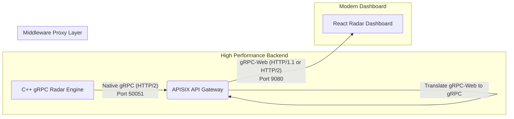

# 🛰️ Stream-Radar gRPC-Web: High-Performance Tactical Simulation

> **Sistem Simulasi Radar Real-Time Berkinerja Tinggi Berbasis gRPC-Web dan Protobuf.**

Sistem ini mendemonstrasikan kekuatan arsitektur **Data-Centric Streaming** menggunakan ekosistem standar industri (gRPC) yang dirancang untuk kebutuhan militer dan taktis dengan skalabilitas tinggi. Dikembangkan dengan **C++ murni** sebagai mesin simulasi, **Apache APISIX** sebagai _gRPC-Web Proxy Middleware_, dan **React (TypeScript)** dengan **OpenLayers** sebagai dashboard visualisasi 60 FPS.

---

## 🏗️ Arsitektur Aliran Data (gRPC-Web Pipeline)

Sistem ini berevolusi dari WebDDS/WebSocket menuju **gRPC Server Streaming**, memanfaatkan Protobuf untuk serialisasi biner yang terstandarisasi, aman, dan efisien.



---

## 🚀 Fitur Utama & Keunggulan

- **📡 Standardized Protobuf Streaming**: Serialisasi data yang sangat terstruktur, _strongly-typed_, dan ringkas untuk menjaga ukuran data (`payload size`) tetap kecil namun aman dari cacat parsing.
- **⚡ Native gRPC Architecture**: Memanfaatkan kapabilitas _Server Streaming RPC_ yang ringan, handal, dan _fault-tolerant_ bawaan dari standar gRPC C++.
- **🌉 APISIX Seamless Translation**: Menjembatani jurang kompatibilitas antara web browser (yang belum mendukung HTTP/2 Trailers secara native) dengan server gRPC HTTP/2 secara transparan.
- **📊 60 FPS Rendering**: Pengoptimalan render OpenLayers untuk menangani ribuan pergerakan objek secara simultan tanpa _frame-drop_, didukung _update state_ reaktif.
- **🎮 Warfare-Speed Simulation**: Simulasi dinamis dengan jumlah kapal (_targetCount_) parametrik, mensimulasikan armada tempur kecepatan tinggi di zona perairan.

---

## 🛡️ Komparasi Paradigma (vs WebDDS)

Perubahan fundamental penerapan QoS dan pola interaksi pada versi gRPC-Web:

| Paradigma            | WebDDS Sebelumnya                         | gRPC-Web Saat Ini                           |
| :------------------- | :---------------------------------------- | :------------------------------------------ |
| **Protokol Dasar**   | Custom POSIX TCP + WebSockets             | gRPC Server Streaming + Protobuf            |
| **QoS Control**      | Diatur pada Node.js Custom Middleware     | Diatur via toleransi timeout/deadline gRPC  |
| **Tipe Data**        | Raw Custom Binary _Zero-copy_             | Protocol Buffers (Terkompresi Biner Cepat)  |
| **Kode Boilerplate** | Parsing _ArrayBuffer_ / _DataView_ Manual | Client-types dan Stub digenerate (Otomatis) |

---

## 🛠️ Teknologi yang Digunakan

| Komponen               | Teknologi                                                 |
| :--------------------- | :-------------------------------------------------------- |
| **Engine (Backend)**   | C++ 17, gRPC, Protobuf (`grpc++`, `protobuf`)             |
| **Middleware / Proxy** | Apache APISIX (Traditional Mode + etcd)                   |
| **Frontend**           | React, TypeScript, gRPC-Web (`grpc-web`), OpenLayers      |
| **Bundler**            | Rspack (High Speed Build) + Tailwind CSS                  |
| **Database Config**    | etcd v3.5.11 (Konfigurasi Data Plane & Control Plane)     |
| **Deployment**         | Docker & Docker-Compose (Multi-stage Containerized Stack) |

---

## 📦 Panduan Instalasi (Container-First)

Proyek ini telah dikontainerisasi penuh menggunakan Docker untuk memastikan isolasi Environment dan C++ Libraries.

### 1. Prasyarat

- **Docker Desktop** (untuk Windows/Mac) atau **Docker Engine** (untuk Linux)

### 2. Langkah Instalasi & Menjalankan

```bash
# 1. Mulai eksekusi semua container pendukung dan layanan
docker-compose up --build -d

# 2. Daftarkan Rute gRPC ke APISIX (Penting: Hanya perlu 1x setelah instalasi)
.\setup_route.ps1
```

### 3. Akses Layanan Utama
- **Radar Dashboard**: [http://localhost:3001](http://localhost:3001)
- **APISIX Gateway Dashboard**: [http://localhost:9000](http://localhost:9000) (User: `admin` | Pass: `admin`)
- **Gateway Traffic Port**: `9080` (gRPC-Web endpoint)

---

## 🗺️ Perjalanan Paket Data (End-to-End)

1.  **C++ gRPC Server (`be-stream-radar-grpcweb`)**: Menghasilkan koordinat objek dinamis secara kontinyu berdasarkan _physics logic_. Kemudian objek dibungkus ke pesan `TrackData` Protobuf dan dikirim melalui pipa gRPC Server-Streaming ke klien per-n millisecond.
2.  **APISIX Proxy (`apisix`)**: Mengikat port 9080 dan mengaktifkan _Plugin gRPC-Web_. Setiap panggilan metode dari Frontend dikonversi dan diteruskan ke C++ Engine melalui jalur `host.docker.internal:50051`.
3.  **Radar Service Client (`fe-stream-radar-grpcweb/src/generated`)**: _Auto-generated stubs_ menangkap setiap paket individual yang mengalir. `RadarServiceClient` memastikan tipe datanya cocok.
4.  **Radar Simulation Hook (`useRadarSimulation.ts`)**: Menerima paket-paket (objek radar). Menyuntikkan update posisi ke dalam matriks `OpenLayers Feature`, mencatat latensi log performa, lalu trigger _re-render_ canvas map tanpa membebani thread utama.


---
*Developed with High-Performance Tactic Architecture Patterns.*
